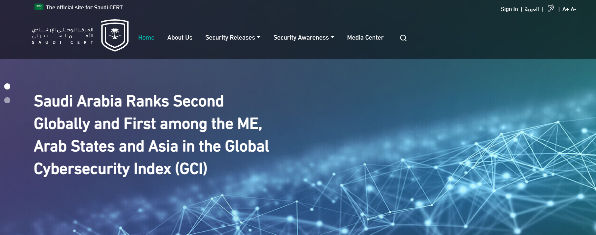
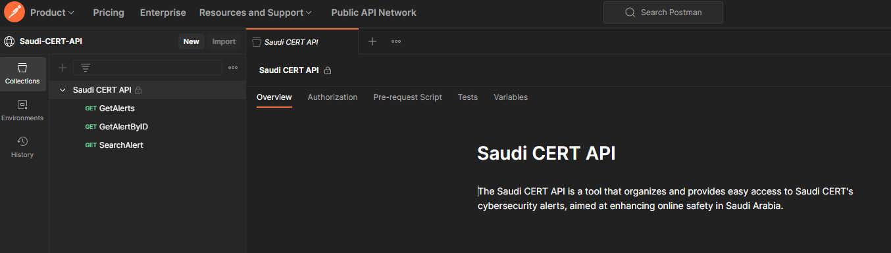
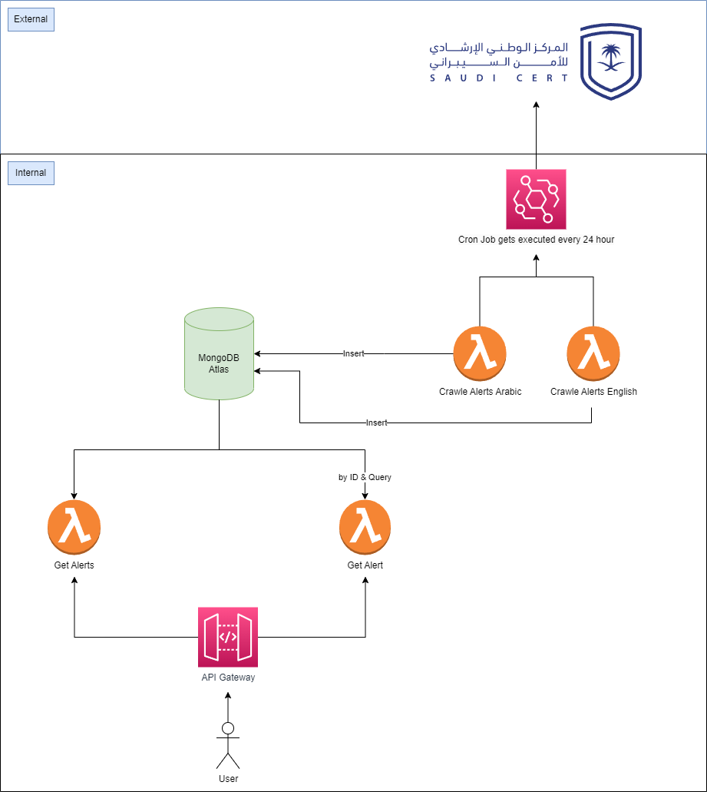

# Saudi Cert Lambda (Parser & Public API) 🚀



## Status


## Tech Used


## Documentation in Postamn

You can find the api documentation, and also you can test the api endpoints from here 🚀

`https://www.postman.com/anqahtani/workspace/saudi-cert-api/collection/30891854-1352c7be-f75f-4677-907e-faf39d50f8cb?action=share&creator=30891854`



## Overview 📖


This repository has a tool and an API for Saudi CERT alerts. Its goal is to help improve online safety knowledge in Saudi Arabia. Using AWS Lambda, this project takes Saudi CERT's alerts, organizes them, and makes them easy to get through a public API.

These AWS Lambda function are designed to retrieve security alerts from a MongoDB database. It supports querying alerts by various attributes such as ID, title, severity, and more.

## Features ✨
- Fetch alerts by ID or other specified attributes.
- Serverless approach leveraging AWS Lambda.
- Integration with MongoDB.

## Deployment Status ✅
The Lambda function has been successfully deployed and is operational.

## Setup 🔧
- Ensure MongoDB is set up with your alerts data.
- Deploy the Lambda function with the necessary environment variables (e.g., `MONGO_URI`).
- Configure Lambda to interact with your MongoDB instance.

## Usage 💡
Invoke the function via AWS SDK or an API Gateway endpoint with appropriate query parameters to retrieve alerts.


## System Diagram




## Testing

You can test endpoints by using the following http.http file 😉

```http
###
# Get Alerts - Fetch multiple alerts with optional query parameters
# Basic usage without query parameters
GET https://1tozt5y6hl.execute-api.us-east-1.amazonaws.com/default/get_alerts

# Usage with query parameters
GET https://1tozt5y6hl.execute-api.us-east-1.amazonaws.com/default/get_alerts?page=1&limit=5

# Fetching alerts based on specific attributes like title or severity
GET https://1tozt5y6hl.execute-api.us-east-1.amazonaws.com/default/get_alerts?title=Weekly%20Vulnerability&severity=Critical

###
# Get Alert - Fetch a single alert by its ID
# Replace <ALERT_ID> with the actual ID of the alert
GET https://sas5g5ymqb.execute-api.us-east-1.amazonaws.com/default/get_alert?alert_id=<ALERT_ID>

# Example with a placeholder ID
GET https://sas5g5ymqb.execute-api.us-east-1.amazonaws.com/default/get_alert?alert_id=5f50c31e8eabf80018e4b255
```

Also you can test through curl 😉

```sh
# Fetching Multiple Alerts Without Query Parameters
$ curl "https://1tozt5y6hl.execute-api.us-east-1.amazonaws.com/default/get_alerts"

# Fetching Multiple Alerts With Query Parameters
$ curl "https://1tozt5y6hl.execute-api.us-east-1.amazonaws.com/default/get_alerts?page=1&limit=5"

# Fetching Alerts Based on Specific Attributes
$ curl "https://sas5g5ymqb.execute-api.us-east-1.amazonaws.com/default/get_alert?title=Weekly%20Vulnerability&severity=Critical"

# Fetching a Single Alert by ID For this, you need to replace <ALERT_ID> with the actual ID of the alert.
$ curl "https://sas5g5ymqb.execute-api.us-east-1.amazonaws.com/default/get_alert?id=6554e21e7573c0e94fb0db30"
```


## Endpoints

| Description | Method | URL | Notes |
|-------------|--------|-----|---------------|
| **Get Alerts** <br> Fetch multiple alerts | `GET` | `https://1tozt5y6hl.execute-api.us-east-1.amazonaws.com/default/get_alerts` | Basic usage without query parameters |
| **Get Alerts with Parameters** <br> Fetch alerts with pagination | `GET` | `https://1tozt5y6hl.execute-api.us-east-1.amazonaws.com/default/get_alerts?page=1&limit=5` | Fetches alerts with page 1 and limit 5 |
| **Get Alerts by Attributes** <br> Fetch alerts based on title or severity | `GET` | `https://1tozt5y6hl.execute-api.us-east-1.amazonaws.com/default/get_alerts?title=Weekly%20Vulnerability&severity=Critical` | Fetches alerts with specific title and severity |
| **Get Alert by ID** <br> Fetch a single alert | `GET` | `https://sas5g5ymqb.execute-api.us-east-1.amazonaws.com/default/get_alert?alert_id=<ALERT_ID>` | Replace `<ALERT_ID>` with the actual ID |
| **Example Get Alert** <br> Example with a placeholder ID | `GET` | `https://sas5g5ymqb.execute-api.us-east-1.amazonaws.com/default/get_alert?alert_id=5f50c31e8eabf80018e4b255` | Example using a specific alert ID |


## Responses

### Get Alert (ID) ⚠️

`https://sas5g5ymqb.execute-api.us-east-1.amazonaws.com/default/get_alert?id=65536f5d500c2238622268d8`

```json
{
  "alert": {
    "_id": {
      "$oid": "65536f5d500c2238622268d8"
    },
    "title": "Weekly Vulnerabilitie…",
    "severity": "Critical",
    "logo": "https://cert.gov.sa/media/non_XcxHHds.jpg",
    "alert_url": "https://cert.gov.sa/en/security-warnings/weekly-vulnerabilities-summary-29-october-4-november/",
    "details": {
      "warning_date": "12 November, 2023",
      "severity_level": "● Critical",
      "warning_number": "2023-5891",
      "target_sector": "All",
      "p_1": "Warning Date",
      "p_2": "Severity Level",
      "p_3": "Warning Number",
      "p_4": "Target Sector",
      "p_5": "12 November, 2023",
      "p_6": "● Critical",
      "p_7": "2023-5891",
      "p_8": "All",
      "link_9": "/documents/137/Weekly_Vulnerabilities_Summary_29_October_4_November.pdf",
      "p_10": "Description:",
      "p_11": "We provide the weekly summary of published vulnerabilities by the National Institute of Standards and Technology (NIST) National Vulnerability Database (NVD) for the week from 29th of October to 4th of November. Vulnerabilities are scored using the Common Vulnerability Scoring System (CVSS) standard as per the following severity:",
      "i_1": "Critical:      CVSS base score of 9.0-10.0",
      "i_2": "High:      CVSS base score of 7.0-8.9",
      "i_3": "Medium:      CVSS base score 4.0-6.9",
      "i_4": "Low:      CVSS base score 0.0-3.9",
      "link_12": "/documents/137/Weekly_Vulnerabilities_Summary_29_October_4_November.pdf",
      "p_13": "We provide the vulnerability information as published by NIST’s NVD. In addition, it is the entity’s or individual’s responsibility to ensure the implementation of appropriate recommendations."
    }
  }
}
```

### Get Alert (Query Parameters) ⚠️

`https://sas5g5ymqb.execute-api.us-east-1.amazonaws.com/default/get_alert?title=Google%20Chrome%20Alert`

```json
{
 {
    "status": "success",
    "message": "Alerts retrieved successfully",
    "total_alerts": 62,
    "alerts": [
        {
            "_id": {
                "$oid": "6554e21d7573c0e94fb0db2c"
            },
            "title": "Weekly Vulnerabilitie…",
            "severity": "Critical",
            "logo": "https://cert.gov.sa/media/non_XcxHHds.jpg",
            "alert_url": "https://cert.gov.sa/en/security-warnings/weekly-vulnerabilities-summary-29-october-4-november/",
            "details": {
                "warning_date": "12 November, 2023",
                "severity_level": "● Critical",
                "warning_number": "2023-5891",
                "target_sector": "All",
                "p_1": "Warning Date",
                "p_2": "Severity Level",
                "p_3": "Warning Number",
                "p_4": "Target Sector",
                "p_5": "12 November, 2023",
                "p_6": "● Critical",
                "p_7": "2023-5891",
                "p_8": "All",
                "link_9": "/documents/137/Weekly_Vulnerabilities_Summary_29_October_4_November.pdf",
                "p_10": "Description:",
                "p_11": "We provide the weekly summary of published vulnerabilities by the National Institute of Standards and Technology (NIST) National Vulnerability Database (NVD) for the week from 29th of October to 4th of November. Vulnerabilities are scored using the Common Vulnerability Scoring System (CVSS) standard as per the following severity:",
                "i_1": "Critical:      CVSS base score of 9.0-10.0",
                "i_2": "High:      CVSS base score of 7.0-8.9",
                "i_3": "Medium:      CVSS base score 4.0-6.9",
                "i_4": "Low:      CVSS base score 0.0-3.9",
                "link_12": "/documents/137/Weekly_Vulnerabilities_Summary_29_October_4_November.pdf",
                "p_13": "We provide the vulnerability information as published by NIST’s NVD. In addition, it is the entity’s or individual’s responsibility to ensure the implementation of appropriate recommendations."
            }
        },
        {
            "_id": {
                "$oid": "6554e21d7573c0e94fb0db2d"
            },
            "title": "Foxit Alert",
            "severity": "High",
            "logo": "https://cert.gov.sa/media/FOX_IT_cAD4gnL.png",
            "alert_url": "https://cert.gov.sa/en/security-warnings/foxit-alert1111/",
            "details": {
                "warning_date": "11 November, 2023",
                "severity_level": "● High",
                "warning_number": "2023-5890",
                "target_sector": "All",
                "p_1": "Warning Date",
                "p_2": "Severity Level",
                "p_3": "Warning Number",
                "p_4": "Target Sector",
                "p_5": "11 November, 2023",
                "p_6": "● High",
                "p_7": "2023-5890",
                "p_8": "All",
                "link_9": "https://www.foxit.com/support/security-bulletins.html",
                "p_10": "",
                "p_11": "Description:",
                "p_12": "Foxit has released a security update to address a vulnerability in their products.",
                "p_13": "Best practice and Recommendations:",
                "p_14": "The CERT team encourages users to review Foxit security advisory and update the affected products:",
                "i_1": "https://www.foxit.com/support/security-bulletins.html"
            }
        },
        {
            "_id": {
                "$oid": "6554e21e7573c0e94fb0db2e"
            },
            "title": "NETGEAR Alert",
            "severity": "High",
            "logo": "https://cert.gov.sa/media/NETGEAR_dMW0amc.png",
            "alert_url": "https://cert.gov.sa/en/security-warnings/netgear-alert-2023-11-11/",
            "details": {
                "warning_date": "11 November, 2023",
                "severity_level": "● High",
                "warning_number": "2023-5889",
                "target_sector": "All",
                "p_1": "Warning Date",
                "p_2": "Severity Level",
                "p_3": "Warning Number",
                "p_4": "Target Sector",
                "p_5": "11 November, 2023",
                "p_6": "● High",
                "p_7": "2023-5889",
                "p_8": "All",
                "strong_9": "Description:",
                "p_10": "NETGEAR has released a security update to address several vulnerabilities in their products.",
                "strong_11": "Best practice and Recommendations:",
                "p_12": "The CERT team encourages users to review NETGEAR security advisory and apply the necessary updates:",
                "i_1": "https://kb.netgear.com/000065866/Security-Advisory-for-Multiple-Vulnerabilities-on-the-NMS300-PSV-2023-0114-PSV-2023-0115?article=000065866"
            }
        },
        {
            "_id": {
                "$oid": "6554e21e7573c0e94fb0db2f"
            },
            "title": "Atlassian Alert",
            "severity": "Critical",
            "logo": "https://cert.gov.sa/media/atlassian_63546K5.png",
            "alert_url": "https://cert.gov.sa/en/security-warnings/atlassian-alert-2023-11-10/",
            "details": {
                "warning_date": "10 November, 2023",
                "severity_level": "● Critical",
                "warning_number": "2023-5888",
                "target_sector": "All",
                "p_1": "Warning Date",
                "p_2": "Severity Level",
                "p_3": "Warning Number",
                "p_4": "Target Sector",
                "p_5": "10 November, 2023",
                "p_6": "● Critical",
                "p_7": "2023-5888",
                "p_8": "All",
                "strong_9": "Description:",
                "p_10": "Atlassian has released security updates to address a vulnerability in their products.",
                "strong_11": "Best practice and Recommendations:",
                "p_12": "The CERT team encourages users to review Atlassian security advisory and apply the necessary updates:",
                "i_1": "https://confluence.atlassian.com/security/cve-2023-46604-apache-activemq-rce-vulnerability-impacts-bamboo-data-center-and-server-1319242919.html?permissionViolation=true"
            }
        },
        {
            "_id": {
                "$oid": "6554e21e7573c0e94fb0db30"
            },
            "title": "Google Chrome Alert",
            "severity": "High",
            "logo": "https://cert.gov.sa/media/Chrome_BwTZEoM.png",
            "alert_url": "https://cert.gov.sa/en/security-warnings/google-chrome-alert119/",
            "details": {
                "warning_date": "9 November, 2023",
                "severity_level": "● High",
                "warning_number": "2023-5887",
                "target_sector": "All",
                "p_1": "Warning Date",
                "p_2": "Severity Level",
                "p_3": "Warning Number",
                "p_4": "Target Sector",
                "p_5": "9 November, 2023",
                "p_6": "● High",
                "p_7": "2023-5887",
                "p_8": "All",
                "link_9": "https://chromereleases.googleblog.com/2023/11/chrome-for-android-update.html",
                "p_10": "",
                "p_11": "Description:",
                "p_12": "Google has released a security update to address several vulnerabilities in Chrome browser for Android .",
                "p_13": "Best practice and Recommendations:",
                "p_14": "The CERT team encourages users to update the affected product, For more information, please follow the below link:",
                "i_1": "https://chromereleases.googleblog.com/2023/11/chrome-for-android-update.html"
            }
        },
        {
            "_id": {
                "$oid": "6554e21e7573c0e94fb0db31"
            },
            "title": "Google Chrome Alert",
            "severity": "High",
            "logo": "https://cert.gov.sa/media/Chrome_fNmvIxD.png",
            "alert_url": "https://cert.gov.sa/en/security-warnings/google-chrome-alert118/",
            "details": {
                "warning_date": "8 November, 2023",
                "severity_level": "● High",
                "warning_number": "2023-5886",
                "target_sector": "All",
                "p_1": "Warning Date",
                "p_2": "Severity Level",
                "p_3": "Warning Number",
                "p_4": "Target Sector",
                "p_5": "8 November, 2023",
                "p_6": "● High",
                "p_7": "2023-5886",
                "p_8": "All",
                "link_9": "https://chromereleases.googleblog.com/2023/11/stable-channel-update-for-desktop.html",
                "p_10": "",
                "p_11": "Description:",
                "p_12": "Google has released security updates to address several vulnerabilities in Chrome browser and ChromeOS.",
                "p_13": "Best practice and Recommendations:",
                "p_14": "The CERT team encourages users to update the affected products, For more information, please follow the below links:",
                "i_1": "https://chromereleases.googleblog.com/2023/11/stable-channel-update-for-desktop.html",
                "i_2": "https://chromereleases.googleblog.com/2023/11/long-term-support-channel-update-for.html"
            }
        },
        {
            "_id": {
                "$oid": "6554e2577573c0e94fb0db34"
            },
            "title": "Google Chrome Alert",
            "severity": "High",
            "logo": "https://cert.gov.sa/media/Chrome_oF8imzn.png",
            "alert_url": "https://cert.gov.sa/en/security-warnings/google-chrome-alert-2023-11-15/",
            "details": {
                "warning_date": "15 November, 2023",
                "severity_level": "● High",
                "warning_number": "2023-5901",
                "target_sector": "All",
                "p_1": "Warning Date",
                "p_2": "Severity Level",
                "p_3": "Warning Number",
                "p_4": "Target Sector",
                "p_5": "15 November, 2023",
                "p_6": "● High",
                "p_7": "2023-5901",
                "p_8": "All",
                "strong_9": "Description:",
                "p_10": "Google has released a security update to address several vulnerabilities in Chrome products.",
                "strong_11": "Best practice and Recommendations:",
                "p_12": "The CERT team encourages users to update the affected products, For more information, please follow the below links:",
                "i_1": "https://chromereleases.googleblog.com/2023/11/stable-channel-update-for-desktop_14.html",
                "i_2": "https://chromereleases.googleblog.com/2023/11/stable-channel-update-for.html"
            }
        },
        {
            "_id": {
                "$oid": "6554e2587573c0e94fb0db35"
            },
            "title": "Aruba Alert",
            "severity": "Critical",
            "logo": "https://cert.gov.sa/media/Aruba-Networks_DLgUEUm.png",
            "alert_url": "https://cert.gov.sa/en/security-warnings/aruba-alert-2023-11-15/",
            "details": {
                "warning_date": "15 November, 2023",
                "severity_level": "● Critical",
                "warning_number": "2023-5900",
                "target_sector": "All",
                "p_1": "Warning Date",
                "p_2": "Severity Level",
                "p_3": "Warning Number",
                "p_4": "Target Sector",
                "p_5": "15 November, 2023",
                "p_6": "● Critical",
                "p_7": "2023-5900",
                "p_8": "All",
                "strong_9": "Description:",
                "p_10": "Aruba has released security updates to address several vulnerabilities in their products.",
                "strong_11": "Best practice and Recommendations:",
                "p_12": "The CERT team encourages users to review Aruba security advisory and update the affected products:",
                "i_1": "https://www.arubanetworks.com/assets/alert/ARUBA-PSA-2023-017.txt"
            }
        },
        {
            "_id": {
                "$oid": "6554e2587573c0e94fb0db36"
            },
            "title": "VMware Alert",
            "severity": "Critical",
            "logo": "https://cert.gov.sa/media/Vmware_4TPABBJ.jpg",
            "alert_url": "https://cert.gov.sa/en/security-warnings/vmware-alert-2023-11-15/",
            "details": {
                "warning_date": "15 November, 2023",
                "severity_level": "● Critical",
                "warning_number": "2023-5899",
                "target_sector": "All",
                "p_1": "Warning Date",
                "p_2": "Severity Level",
                "p_3": "Warning Number",
                "p_4": "Target Sector",
                "p_5": "15 November, 2023",
                "p_6": "● Critical",
                "p_7": "2023-5899",
                "p_8": "All",
                "strong_9": "Description:",
                "p_10": "VMware has released a security update to address a critical vulnerability in its product.",
                "strong_11": "Best practice and Recommendations:",
                "p_12": "The CERT team encourages users to review VMware security advisory and update the affected product:",
                "i_1": "https://www.vmware.com/security/advisories/VMSA-2023-0026.html"
            }
        },
        {
            "_id": {
                "$oid": "6554e2587573c0e94fb0db37"
            },
            "title": "Adobe Alert",
            "severity": "Critical",
            "logo": "https://cert.gov.sa/media/Adobe_rG1RtZq.png",
            "alert_url": "https://cert.gov.sa/en/security-warnings/adobe-alert1114/",
            "details": {
                "warning_date": "14 November, 2023",
                "severity_level": "● Critical",
                "warning_number": "2023-5898",
                "target_sector": "All",
                "p_1": "Warning Date",
                "p_2": "Severity Level",
                "p_3": "Warning Number",
                "p_4": "Target Sector",
                "p_5": "14 November, 2023",
                "p_6": "● Critical",
                "p_7": "2023-5898",
                "p_8": "All",
                "link_9": "https://helpx.adobe.com/security/products/coldfusion/apsb23-52.html",
                "p_10": "",
                "p_11": "Description:",
                "p_12": "Adobe has released security updates to address several vulnerabilities in their products.",
                "p_13": "Best practice and Recommendations:",
                "p_14": "The CERT team encourages users to review Adobe security advisory and apply the necessary updates:",
                "i_1": "·https://helpx.adobe.com/security/products/coldfusion/apsb23-52.html",
                "i_2": "·https://helpx.adobe.com/security/products/robohelp-server/apsb23-53.html",
                "i_3": "·https://helpx.adobe.com/security/products/acrobat/apsb23-54.html",
                "i_4": "·https://helpx.adobe.com/security/products/photoshop/apsb23-56.html",
                "i_5": "·https://helpx.adobe.com/security/products/framemaker/apsb23-58.html",
                "i_6": "·https://helpx.adobe.com/security/products/incopy/apsb23-60.html",
                "i_7": "·https://helpx.adobe.com/security/products/media-encoder/apsb23-63.html",
                "i_8": "·https://helpx.adobe.com/security/products/audition/apsb23-64.html",
                "i_9": "·https://helpx.adobe.com/security/products/premiere_pro/apsb23-65.html",
                "i_10": "·https://helpx.adobe.com/security/products/after_effects/apsb23-66.html"
            }
        }
    ],
    "next_page": "https://1tozt5y6hl.execute-api.us-east-1.amazonaws.com/default/get_alerts?page=2&limit=10"
}
```

## License 📄
Licensed under the MIT License.

## Acknowledgments 👏
- AWS Lambda
- MongoDB
